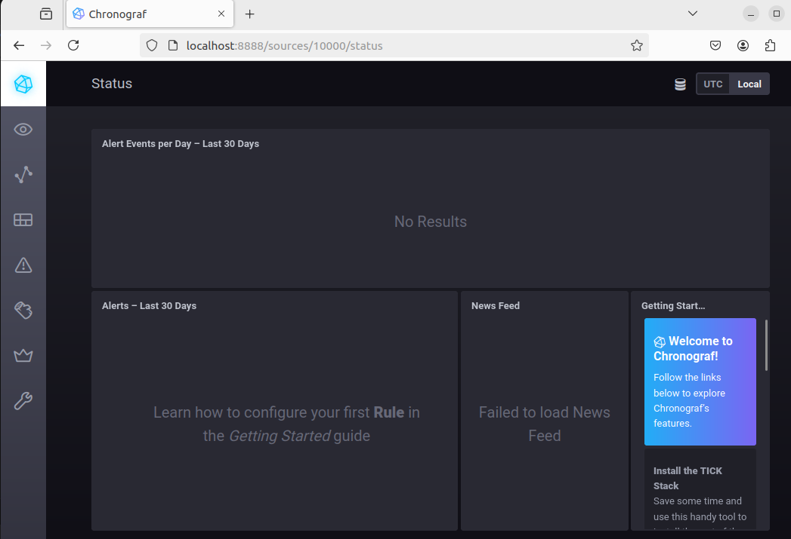
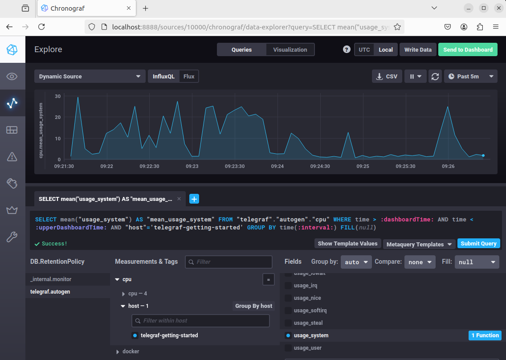
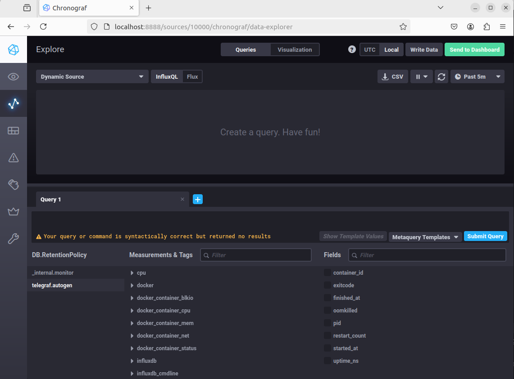

## Домашнее задание к занятию "Системы мониторинга"
1. Вас пригласили настроить мониторинг на проект. На онбординге вам рассказали, что проект представляет из себя 
платформу для вычислений с выдачей текстовых отчетов, которые сохраняются на диск. Взаимодействие с платформой 
осуществляется по протоколу http. Также вам отметили, что вычисления загружают ЦПУ. Какой минимальный набор метрик вы
выведите в мониторинг и почему?

<ins>Ответ:</ins>

Мой минимальный набор метрик следуюший:
- загрузка CPU - вычисления загружают ЦПУ
- доступность сервиса по http - взаимодействие с платформой осуществляется по протоколу http
- наличие свободного дискогово пространства - текстовые отчеты сохраняются на диск
#

2. Менеджер продукта посмотрев на ваши метрики сказал, что ему непонятно что такое RAM/inodes/CPUla. Также он сказал, что хочет понимать, насколько мы выполняем свои обязанности перед клиентами и какое качество обслуживания. Что вы можете ему предложить?

<ins>Ответ:</ins>

RAM/inodes/CPUla - это метрики использования оперативной памяти/ наличие свободного кол-ва inode/ load average - среднее количество процессов, ожидающих выполнения на ядре процессора за последние 1, 5 и 15 минут.
#

3. Вашей DevOps команде в этом году не выделили финансирование на построение системы сбора логов. Разработчики в свою очередь хотят видеть все ошибки, которые выдают их приложения. Какое решение вы можете предпринять в этой ситуации, чтобы разработчики получали ошибки приложения?

<ins>Ответ:</ins>

В данном случае оптимальным решением будет использовать систему мониторинга на базе стека TICK или Prometheus в среде docker.

#

4. Вы, как опытный SRE, сделали мониторинг, куда вывели отображения выполнения SLA=99% по http кодам ответов. Вычисляете этот параметр по следующей формуле: summ_2xx_requests/summ_all_requests. Данный параметр не поднимается выше 70%, но при этом в вашей системе нет кодов ответа 5xx и 4xx. Где у вас ошибка?

<ins>Ответ:</ins>

В формуле не учтены запросы с кодом 3хх, т.е. формула должна быть такой  
- (summ_2xx_requests + summ_3xx_requests) / (summ_all_requests)

#

5. Опишите основные плюсы и минусы pull и push систем мониторинга.

<ins>Ответ:</ins>

Плюсы pull-систем мониторинга:
- подлинность данных
- легкость шифрования
- низкая нагрузка сервер 
- гибкость

Минусы pull-систем мониторинга:
- сложность репликации данных
- менее гибкая настройка

Плюсы pull-систем мониторинга:
- простота установки и настройки
- применение UDP протокола передачи данных
- масштабируемость

Минусы push-систем мониторинга:
- нагрузка на сеть
- необходим контроль подленности данных

#

6. Какие из ниже перечисленных систем относятся к push модели, а какие к pull? А может есть гибридные?

- Prometheus 
- TICK
- Zabbix
- VictoriaMetrics
- Nagios

<ins>Ответ:</ins>

- Prometheus (pull-модель)
- TICK (push-модель)
- Zabbix (push/pull-модель)
- VictoriaMetrics (push/pull-модель)
- Nagios (pull-модель)

#

7. Скриншот веб-интерфейса ПО chronograf (`http://localhost:8888`)  

#
 8. Скриншот с отображением метрик утилизации cpu из веб-интерфейса
 

 #

 9. Скриншот списка метрик, связанных с docker
  