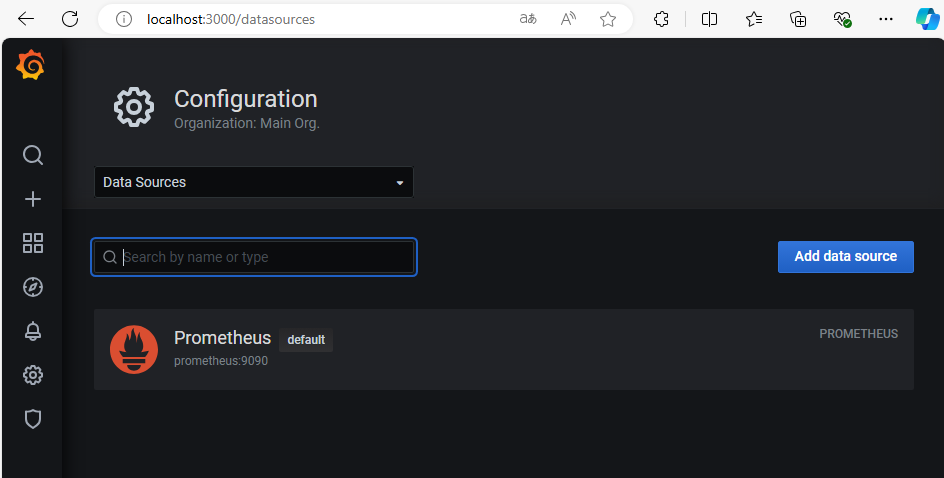
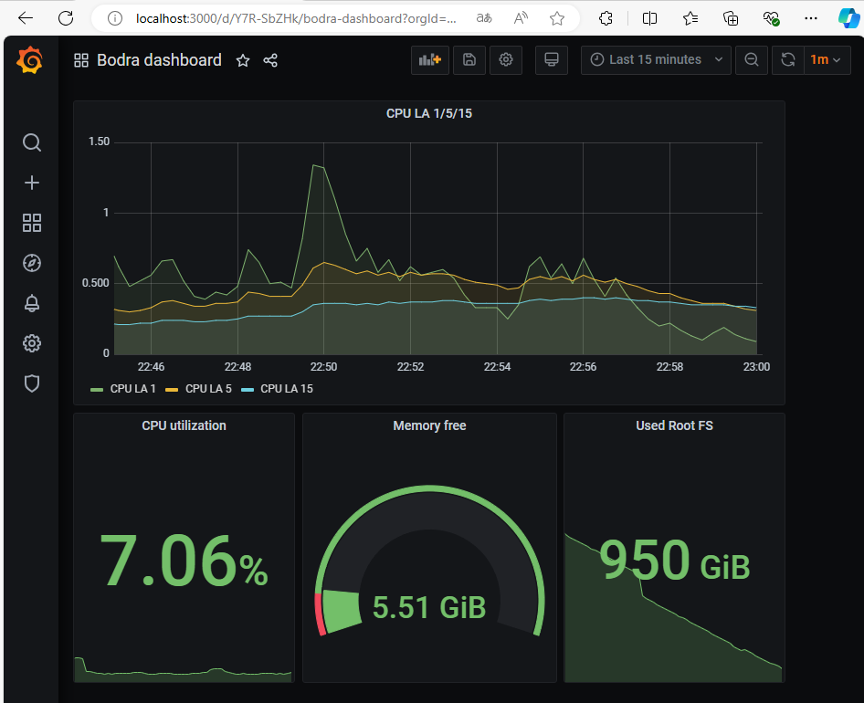

## Домашнее задание к занятию «Средство визуализации Grafana»

### Задание 1
Cкриншот веб-интерфейса grafana со списком подключенных Datasource


### Задание 2
Скриншот дашборда


Promql-запросы:
1. Утилизация CPU для nodeexporter (в процентах, 100-idle)
```
100 - (avg (rate(node_cpu_seconds_total{ job="nodeexporter", mode="idle" }[1m])) * 100)
```
2. CPULA 1/5/15
```
node_load1{job="nodeexporter"}
node_load5{job="nodeexporter"}
node_load15{job="nodeexporter"}
```
3. Количество свободной оперативной памяти
```
node_memory_MemFree_bytes{job="nodeexporter"}
```
4. Количество места на файловой системе
```
node_filesystem_avail_bytes{device="/dev/sdc", fstype="ext4", instance="nodeexporter:9100", job="nodeexporter", mountpoint="/"}
```

### Задание 3